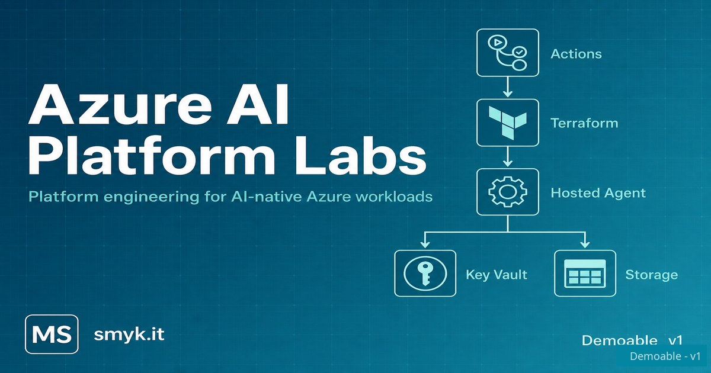

# Azure AI Platform Labs

Small, practical labs exploring **Platform Engineering for AI-native systems** on Azure.

Public reference and learning project - not a commercial product.

**Author:** [Michał Smyk](https://smyk.it/)

---

## What this is

Umbrella repository for **shippable labs** - build, learn, document, share. Each lab stands alone; the repo grows as learning progresses.

Platform patterns first (identity, IaC, CI/CD, observability); agents and MCP are workloads on that foundation. Labs ship **runnable reference paths** on Azure; the portable idea is the pattern, not a mandate for those exact services.

**Status:** two labs at **Demoable v1** - more ship as learning progresses.

---

## Labs

| Lab | Status | Description |
|-----|--------|-------------|
| [Hosted Agents](./labs/hosted-agents/) | Demoable v1 | Azure AI Foundry Hosted Agents infrastructure lab - platform foundation for AI workloads with Terraform, GitHub Actions, and Microsoft Foundry. |
| [MCP on Azure](./labs/mcp-on-azure/) | Demoable v1 | MCP on Container Apps + Entra - platform vs user tool identity, VNet/PE, Terraform + .NET. Acceler8it 2026 follow-up. |

More labs will appear here as they ship. Each stands alone; the repo grows with learning, not upfront scaffolding.

---

## Technical direction

| Area | Choice |
|------|--------|
| Cloud | Microsoft Azure |
| IaC | Terraform |
| CI/CD | GitHub Actions |
| Runtime | Azure Container Apps |
| Identity | Managed Identity (preferred over API keys) |
| AI | Azure AI Foundry, Azure OpenAI |
| Language | C# / .NET (primary) |

---

## Related work

| Artifact | Link |
|----------|------|
| Blog | [blog.smyk.it](https://blog.smyk.it/) |
| Talks | [blog.smyk.it/talks/](https://blog.smyk.it/talks/) |
| AI tooling for Azure DevOps | [AiNowPolska-June2026](https://github.com/Azkel/AiNowPolska-June2026) |
| AI Foundry + Terraform | [blog post](https://blog.smyk.it/posts/2026/azure-ai-foundry-terraform/) |

---

## Contributing

See [`CONTRIBUTING.md`](./CONTRIBUTING.md).

---

## License

MIT - see [`LICENSE`](./LICENSE).

---

## Disclaimer

Community project by [Michał Smyk](https://github.com/Azkel). Not affiliated with or endorsed by Microsoft, SoftServe, or Azure product teams.
