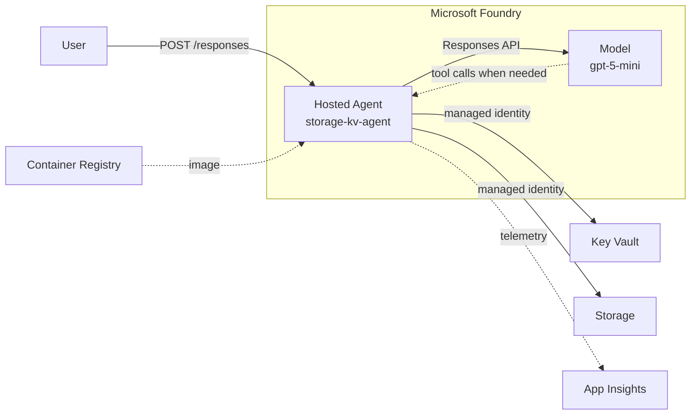
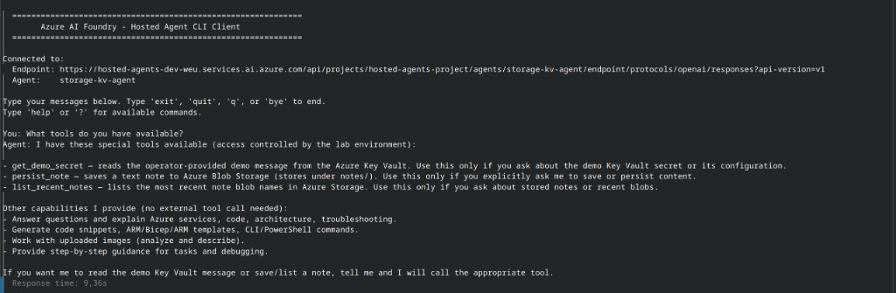

# Hosted Agents Lab

This lab demonstrates how to deploy infrastructure for **Azure AI Foundry Hosted Agents** using Terraform and GitHub Actions, including a sample agent that integrates **Azure Storage** and **Key Vault** via managed identity.

## Overview

Azure AI Foundry Hosted Agents provide a managed environment for running AI workloads with built-in security, scaling, and integration with Azure AI services. This lab provides both the infrastructure foundation and a sample agent that shows how the agent instance identity accesses Azure data-plane resources with Azure RBAC (no storage keys or Key Vault secrets in the image).

### Target Audience

- **Platform Engineers** building AI workload foundations on Azure
- **DevOps Engineers** implementing CI/CD for AI agents
- **Cloud Architects** designing secure, scalable AI systems
- **Developers** learning Azure AI Foundry Hosted Agents patterns

## Sample: Hosted Agent with Storage + Key Vault

This lab includes a **BYO Responses** sample agent that demonstrates:
- **Bring Your Own (BYO)** approach using the **Responses protocol**
- **C#** implementation using `.NET 10` and the `Azure.AI.AgentServer.Responses` SDK
- **Docker** containerization for deployment to Foundry Agent Service
- Integration with **Microsoft Foundry** models via the Responses API
- **Function tools** for **Azure Key Vault** and **Azure Storage** with `DefaultAzureCredential` (agent instance identity)
- On-demand tool calls — Storage/Key Vault run only when the model needs them

### Sample Location
- **Source code**: `labs/hosted-agents/src/storage-kv-agent/`
- **Main handler**: `storage-kv-agent/Program.cs`
- **Dockerfile**: `storage-kv-agent/Dockerfile`
- **Project file**: `storage-kv-agent/StorageKvAgent.csproj`

### Sample Features
- Forwards user input to a Foundry model via the Responses API
- Maintains conversation history across turns
- Exposes **Key Vault** and **Storage** as Responses function tools (`get_demo_secret`, `persist_note`, `list_recent_notes`)
- Runs a tool loop so the model calls Azure only when the user asks for those capabilities
- Handles streaming responses with SSE (Server-Sent Events)
- Includes built-in health endpoints (`/readiness`)
- Automatically integrates with Application Insights for telemetry

### What the Sample Does
On each request the agent:
1. Receives a user message via the `/responses` endpoint
2. Retrieves conversation history using `ResponseContext.GetHistoryAsync()`
3. Calls a Foundry model (e.g. `gpt-5-mini`) with tools registered for Key Vault and Storage
4. If the model requests a tool, executes it via managed identity (Key Vault Secrets User / Storage Blob Data Contributor) and continues the Responses loop
5. Returns the model's final text response (ordinary Q&A does not touch Storage or Key Vault)

**Required Environment Variables**:
- `FOUNDRY_PROJECT_ENDPOINT` - Foundry project endpoint (auto-injected when hosted)
- `AZURE_AI_MODEL_DEPLOYMENT_NAME` - Model deployment name (default: `gpt-5-mini`)
- `APPLICATIONINSIGHTS_CONNECTION_STRING` - App Insights connection string (injected by Foundry when the project AppInsights connection exists; created by Terraform)
- `AZURE_STORAGE_ACCOUNT_NAME` - Agent data storage account
- `AZURE_STORAGE_CONTAINER_NAME` - Blob container (default: `agent-notes`)
- `AZURE_KEY_VAULT_URI` - Key Vault URI
- `AZURE_KEY_VAULT_SECRET_NAME` - Demo secret name (default: `agent-demo-message`)

### Managed identity and RBAC

Hosted agents authenticate with a dedicated **agent instance identity** created at deploy time. Terraform cannot know that principal ID ahead of time, so:

| When | What |
|------|------|
| **Terraform apply** | Creates Storage Account + container, Key Vault secret, and optional contributor grants for local developers (`additional_*_principal_ids`) |
| **Docker deploy workflow** | After `azd deploy`, looks up `instance_identity.principal_id` and assigns **Storage Blob Data Contributor** + **Key Vault Secrets User** |

To change the demo message the agent reads, set Terraform variable `agent_demo_secret_value`, or update the secret in the portal / CLI after apply:

```bash
az keyvault secret set \
  --vault-name kv-hosted-agents-dev-weu \
  --name agent-demo-message \
  --value "Your custom operator message"
```

## Architecture



### Data Flow

1. **User request** → Agent container via `/responses` endpoint
2. **Agent handler** receives input, calls Foundry model via `ProjectResponsesClient`
3. **Model** may request tools (Key Vault secret read, Storage blob write/list)
4. **Agent executes tools** using managed identity (no hardcoded credentials)
5. **Tool results** fed back to model for final response generation
6. **Response** returned to user, with telemetry sent to Application Insights

### Security Boundaries

| Component | Identity | Access Method | Permissions |
|-----------|----------|---------------|-------------|
| Agent Container | SystemAssigned Managed Identity | Azure AD | Storage Blob Data Contributor, Key Vault Secrets User, AcrPull |
| Terraform Deployer | GitHub OIDC / User | Azure AD | Foundry User, Contributor on RG, Key Vault Administrator |
| Local Developer | Azure CLI | Azure AD | Granted via `additional_*_principal_ids` variables |

**Network**: VNet injection isolates Foundry account; Storage/Key Vault accessible via Azure AD auth only (no account keys).

## Learning Outcomes

By completing this lab, you will learn:

- **Infrastructure as Code for AI**: How to deploy Microsoft Foundry, networking, storage, and identity using Terraform
- **Managed Identity Pattern**: Secure Azure resource access without hardcoded credentials using agent instance identity
- **BYO Responses Protocol**: Implementing a custom agent using the Responses protocol with .NET 10 and the Azure.AI.AgentServer.Responses SDK
- **On-Demand Tool Integration**: Building function tools for Key Vault and Storage that the model calls only when needed
- **Foundry Hosted Agents Lifecycle**: From Terraform infrastructure to azd deploy, including RBAC assignment for the agent identity
- **Telemetry and Observability**: Automatic Application Insights integration with OpenTelemetry via the AgentServer SDK
- **CI/CD for Agents**: GitHub Actions workflows for Terraform deployment and Docker build/push/deploy

## What This Lab Provides

This lab deploys infrastructure using the shared `platform-core` module plus lab-specific resources:

**Shared Infrastructure (platform-core module):**
- **Resource Group** with proper tagging
- **Virtual Network** for network isolation
- **Subnet** for hosting agent resources
- **Log Analytics Workspace** for monitoring
- **Microsoft Foundry Cognitive Account** (kind: AIServices) - the core Foundry resource
- **Application Insights** for agent observability (linked to the Foundry project so agents get `APPLICATIONINSIGHTS_CONNECTION_STRING`)

**Lab-Specific Resources:**
- **Azure Container Registry** for Docker images
- **Azure Key Vault** for secrets management (using Azure RBAC), including App Insights connection string and the user-provided agent demo secret
- **Azure Storage Account** (Azure AD auth only) with `agent-notes` blob container for agent persistence
- **Microsoft Foundry Project** for hosting agents
- **Model deployment** (`gpt-5-mini` by default) on the Foundry account for agent inference

## Prerequisites

### Azure Tools
- **Azure subscription** with Contributor or Owner permissions
- **Azure CLI** (≥ 2.50.0) installed and logged in
  - Verify: `az --version`
- **Azure Developer CLI (`azd`)** - Required for agent deployment
  - [Installation Guide](https://learn.microsoft.com/en-us/azure/developer/azure-developer-cli/install-azd)
  - Verify: `azd --version`
- **GitHub repository** with GitHub Actions enabled
- **Permissions required**: Contributor on resource group, or Owner on subscription

### Development Tools (for local testing)
- **.NET 10 SDK** - Required to build and run the sample locally
  - [Download .NET 10](https://dotnet.microsoft.com/download/dotnet/10.0)
  - Verify: `dotnet --version`
- **Docker** - For local container builds
- **jq** (optional) - For pretty-printing JSON responses

## Region

This lab targets **West Europe** (`westeurope` / `weu`). Hosted Agents data-plane APIs were verified there; Poland Central control-plane deploy can succeed while project/agent APIs return `Project not found`.

## Quick Start

**Expected deployment time**: ~15-20 minutes (Terraform apply: 10-15 min, Docker build/push/deploy: 5-10 min)
**Time to first demo**: ≤ 30 minutes (deploy + test + validate)

**Smoke test**: After both Actions workflows succeed, run `./demo.sh` from this directory to resolve the live lab RG and prove Key Vault + Storage tool calls (optional; curl samples below work the same).

Follow these steps to deploy the infrastructure and sample agent:

### 1. Set Up Terraform Backend

Before deploying, set up Azure storage for Terraform state:

```bash
# See detailed guide
# docs/infrastructure/terraform-backend-setup.md
```

### 2. Configure GitHub Secrets

**With OIDC (Recommended):**

Set these secrets in your GitHub repository Settings > Secrets and variables > Actions:

- `ARM_CLIENT_ID` - Azure AD Application ID
- `ARM_SUBSCRIPTION_ID` - Azure Subscription ID
- `ARM_TENANT_ID` - Azure AD Tenant ID
- `TF_STATE_RESOURCE_GROUP` - Terraform state resource group (e.g., `rg-tfstate`)
- `TF_STATE_STORAGE_ACCOUNT` - Terraform state storage account
- `TF_STATE_CONTAINER` - Terraform state container (e.g., `state`)

**With Client Secrets (Alternative):**

Additionally include:
- `ARM_CLIENT_SECRET` - Azure AD Application Secret

### 3. Deploy Infrastructure

**Manual Deployment:**
1. Go to GitHub Actions > Workflows
2. Run `Terraform Deploy - Hosted Agents` workflow
3. Select action: `plan` (to review changes), then `apply` (to deploy)

**Pull Request:**
- Changes to Terraform files will automatically trigger a `terraform plan` for review

**Important:** The infrastructure (ACR, Storage, Key Vault, Foundry account with project management enabled) must be deployed before building and deploying the agent.

**Note:** The Foundry Cognitive Account requires `allowProjectManagement=true` to create projects. This is automatically configured by Terraform. If you have existing infrastructure deployed with older configuration, you may need to:
- Run `terraform apply` again on the updated configuration to enable project management
- Or manually enable it via Azure CLI: `az cognitiveservices account update --name <account> --resource-group <rg> --allow-project-management true`

### 4. Build and Deploy the Sample Agent

After infrastructure is deployed, build and deploy the sample agent:

1. Run the **Docker Build, Push and Deploy - Hosted Agents** workflow
2. The workflow will:
   - Build the Docker image from the sample source
   - Push it to Azure Container Registry
   - Deploy it to Microsoft Foundry
   - Grant the agent instance identity access to Storage and Key Vault

## Terraform Configuration

The Terraform configuration is in the `terraform/` subdirectory:

```
.
├── terraform/
│   ├── main.tf          # Lab configuration using platform-core module
│   ├── providers.tf     # Terraform providers
│   └── variables.tf     # Environment variables
```

Useful variables for this sample:

| Variable | Purpose |
|----------|---------|
| `agent_demo_secret_value` | User-provided text stored in Key Vault for the agent to read |
| `agent_demo_secret_name` | Secret name (default `agent-demo-message`) |
| `storage_blob_container_name` | Blob container (default `agent-notes`) |
| `additional_storage_blob_data_contributor_principal_ids` | Local developer object IDs for blob access |
| `additional_key_vault_secrets_user_principal_ids` | Local developer object IDs for secret read |

## Module Configuration

The lab uses the shared `platform-core` module:

```hcl
module "platform_core" {
  source = "../../shared-modules/platform-core"

  workload_name = "hosted-agents"
  location      = "westeurope"
  environment   = local.environment # hardcoded to "dev" for this lab

  # Network configuration (172.16/16; required in regions without Class A / 10.x for Agent Service)
  vnet_address_space      = ["172.16.0.0/16"]
  subnet_address_prefixes = ["172.16.1.0/24"]

  # Monitoring
  log_analytics_sku               = "PerGB2018"
  log_analytics_retention_in_days = 30

  # Microsoft Foundry + Hosted Agents network injection at account create
  foundry_sku                             = "S0"
  foundry_agent_network_injection_enabled = true
}
```

## CI/CD Pipeline

This lab uses **GitHub Actions** with OIDC for deploy and teardown (not local developer machines).

### Build Pipeline

The sample is built using the **[Docker Build, Push and Deploy - Hosted Agents](../../.github/workflows/docker-build-push-hosted-agents.yml)** workflow:

**Workflow file**: `.github/workflows/docker-build-push-hosted-agents.yml`

**What it does:**
1. **Validates infrastructure** - Checks that ACR and Foundry project exist (must be deployed first via Terraform)
2. **Builds Docker image** - Uses `docker/build-push-action` to build the agent image from `labs/hosted-agents/src/storage-kv-agent/Dockerfile`
3. **Pushes to ACR** - Tags and pushes the image to Azure Container Registry with multiple tags (branch, tag, sha, latest)
4. **Deploys to Foundry** - Uses `azd ai agent deploy` to deploy the agent to the Foundry project
5. **Grants RBAC** - Assigns Storage Blob Data Contributor and Key Vault Secrets User to the agent instance identity

**Build options:**
- **Full pipeline**: Builds, pushes, and deploys the agent
- **Build only**: `skip-deploy: true` - Builds and pushes without deploying
- **Deploy only**: `deploy-only: true` - Deploys an existing image (uses `latest` tag)

**Naming convention** (lab uses a single hardcoded `dev` environment in resource names):
- ACR name: `acrhostedagentsdevweu`
- Storage account: `sthostedagents{env}{location}{####}` (e.g. `sthostedagentsdevweu4821`) — 4-digit random suffix for recreate-friendly naming within the 24-char Azure limit
- Key Vault: `kv-hosted-agents-dev-weu`
- Agent name: `storage-kv-agent`
- Image: `{ACR}.azurecr.io/storage-kv-agent:{tag}`

**References:**
- [Set up CI/CD with Azure Developer CLI](https://learn.microsoft.com/en-us/azure/foundry/agents/how-to/set-up-ci-cd-cli)
- [Deploy from private ACR](https://learn.microsoft.com/en-us/azure/foundry/agents/how-to/deploy-hosted-agent-private-azure-container-registry)
- [Manage hosted agent identity / RBAC](https://learn.microsoft.com/en-us/azure/foundry/agents/how-to/manage-hosted-agent)

## Outputs

After deployment, the Terraform module provides these outputs:

**From platform-core module:**
- `resource_group_name` - The created resource group
- `vnet_id` - The virtual network ID
- `subnet_id` - The subnet ID
- `log_analytics_workspace_id` - Log Analytics workspace ID
- `foundry_id` - Microsoft Foundry account ID
- `foundry_name` - Microsoft Foundry account name
- `foundry_endpoint` - Microsoft Foundry account endpoint URL
- `application_insights_*` - Application Insights resource details

**Lab-specific outputs:**
- `container_registry_*` - Azure Container Registry details
- `key_vault_*` - Azure Key Vault details
- `agent_demo_secret_name` - Demo secret name read by the agent
- `storage_account_*` / `storage_blob_container_name` - Agent data storage details
- `foundry_project_*` - Microsoft Foundry project details (endpoint, ID, name)

## Cost Optimization

This lab is configured for minimal cost:

- **Log Analytics**: 30-day retention (minimum)
- **Foundry SKU**: S0 (development tier)
- **Storage**: Standard LRS, shared access keys disabled
- **Location**: West Europe
- **Daily cleanup**: resources are destroyed at 9 PM UTC unless you re-deploy
- **Estimated cost**: ~$2-5/day for active lab (Foundry S0 + model deployment + Storage + KV + ACR + App Insights)

## Operational Considerations

### Monitoring Setup

Application Insights is automatically integrated with the Foundry project. The agent exports OpenTelemetry traces when `APPLICATIONINSIGHTS_CONNECTION_STRING` is present (auto-injected by Foundry). See [Monitoring](#monitoring) section for query examples.

### Scaling Notes

This lab is designed for **development and demonstration**, not production scaling:
- **Foundry SKU**: S0 (development tier) — not suitable for production workloads
- **Model capacity**: 10 TPM (thousands of tokens per minute) — sufficient for lab testing
- **Agent container**: 0.5 CPU, 1Gi memory — minimal resources for the sample agent
- **Single agent instance**: The lab deploys one agent; production would need multiple instances behind a load balancer
- **No autoscaling**: Foundry Hosted Agents do not currently support autoscaling in this configuration

For production workloads, consider:
- Upgrading to Foundry S1/S2 SKUs
- Increasing model capacity based on expected load
- Deploying multiple agent instances
- Implementing queue-based workload distribution

### Known Limitations

| Limitation | Impact | Workaround |
|------------|--------|------------|
| Region support | Hosted Agents APIs verified in West Europe; Poland Central control-plane works but data-plane returns "Project not found" | Use West Europe for this lab |
| Soft-delete retention | Storage account names reserved for ~14 days after deletion | 4-digit random suffix prevents naming collisions |
| App Insights injection | `APPLICATIONINSIGHTS_CONNECTION_STRING` only injected if project has AppInsights connection | Terraform creates this connection automatically |
| RBAC propagation delay | Role assignments for agent identity may take 1-2 minutes to propagate | Wait before invoking agent after deploy |
| Model availability | gpt-5-mini may have quota limits or regional availability | Use alternative models if needed |
| Local testing | Requires manually granting developer identity Storage/Key Vault RBAC | Use `additional_*_principal_ids` Terraform variables |
| Local `azd deploy` | Interactive user may get 403 on `agents/write`; OIDC deployer in Actions has the required role | Use **Docker Build, Push and Deploy** workflow for agent deploy |
| Foundry account concurrency | Concurrent model deployment + project create can 409 (`RequestConflict`) | Terraform serializes project after model deploy and retries 409s |

### Trade-offs and Decisions Made

| Decision | Rationale | Alternative Considered | Why Not |
|----------|-----------|----------------------|---------|
| **Azure RBAC for Key Vault** | Simpler management, no access policy complexity, works well with frequent recreate cycles | Key Vault access policies | More complex to manage, especially with lab recreate cycles |
| **BYO Responses Protocol** | Maximum flexibility, full control over agent behavior, .NET native | Azure-native agent SDKs | Less flexible, may not support all custom tool patterns |
| **Managed Identity for agent** | Secure, no secrets in container, Azure AD integration | Service Principal / API keys | Secrets would need to be injected, less secure |
| **Storage with Azure AD auth only** | More secure, no account keys to rotate | Shared access keys | Less secure, key rotation complexity |
| **GitHub Actions with OIDC** | Secure, no long-lived credentials | Service principal with secrets | Secrets management overhead |
| **Terraform for IaC** | Mature, multi-cloud, strong community | Bicep | Azure-only, less flexible for multi-cloud patterns |
| **Daily auto-cleanup** | Prevents cost overruns from forgotten labs | Manual cleanup only | Easy to forget, leads to unexpected costs |
| **4-digit random storage suffix** | Avoids soft-delete name collision | Static names | Would block recreate for 14 days after destroy |

### When to Use This Pattern vs Alternatives

**Use this pattern when:**
- You need **secure, managed agent hosting** without infrastructure management
- You want **built-in Azure integration** (identity, networking, monitoring)
- Your workloads are **event-driven or request-based** (not long-running)
- You need **Azure resource access** from your agent (Storage, Key Vault, etc.)
- You prefer **BYO container approach** with full code control

**Consider alternatives when:**
- You need **GPU acceleration** — use Azure Container Apps with GPU or AKS
- You need **long-running background jobs** — use Azure Functions or Container Apps Jobs
- You need **custom scaling logic** — use AKS with custom operators
- You need **non-Azure cloud deployment** — use open-source agent frameworks (LangGraph, CrewAI)
- You need **lower latency** — consider Azure OpenAI direct calls for simple prompts
- You have **very high throughput** — multiple agent instances may be needed

## Cleanup

To avoid ongoing costs, resources are automatically destroyed daily at 9 PM UTC via the cleanup workflow. You can also manually trigger destruction.

**Important Note on Resource Deletion:**
- **Deleted by Terraform destroy (billing stops)**: Resource Group, VNet, Subnet, Storage Account, model deployment
- **Storage account name reservation**: Azure keeps deleted storage accounts recoverable for ~**14 days** and **does not provide a purge API**. This lab appends a **4-digit random suffix** (`sthostedagentsdevweu####`, 24 chars max) so destroy/recreate does not collide with the reserved name ([recover deleted storage account](https://learn.microsoft.com/en-us/azure/storage/common/storage-account-recover)).
- **Blob soft-delete**: Disabled on the lab storage account so destroy does not leave soft-deleted blobs behind inside the account.
- **Purged on destroy via azurerm provider features** (when purge protection allows):
  - **Azure Key Vault**: `purge_soft_delete_on_destroy = true`
- **Microsoft Foundry Cognitive Account**: soft-deleted by Terraform (`purge_soft_delete_on_destroy = false`), then purged by `labs/hosted-agents/terraform/scripts/purge-soft-deleted-foundry.sh` with wait/retry. Inline provider purge races agent network-injection teardown and fails with HTTP 409 “provisioning state is not terminal”.
- **Other soft-delete / retention**:
  - **Azure Container Registry (ACR)**: Soft delete with minimum retention; auto-purged after the retention period
  - **Application Insights**: Smart Detection rules can block deletion in some cases
- **Manual purge examples** (where Azure supports it):
  ```bash
  # Purge Cognitive Services / Foundry account (if still soft-deleted)
  labs/hosted-agents/terraform/scripts/purge-soft-deleted-foundry.sh \
    westeurope rg-hosted-agents-dev-weu cog-hosted-agents-dev-weu
  # or:
  az cognitiveservices account purge --name cog-hosted-agents-dev-weu --resource-group rg-hosted-agents-dev-weu --location westeurope
  
  # Purge Key Vault (if still soft-deleted)
  az keyvault purge --name kv-hosted-agents-dev-weu --location westeurope
  
  # Storage account: no purge command — wait for the ~14-day recovery window
  ```

## References

### Microsoft Foundry
- [Azure AI Foundry Hosted Agents](https://learn.microsoft.com/en-us/azure/foundry/agents/concepts/hosted-agents#platform-details)
- [Hosted Agents Overview](https://learn.microsoft.com/en-us/azure/foundry/agents/concepts/hosted-agents)
- [Deploy Hosted Agent from Private ACR](https://learn.microsoft.com/en-us/azure/foundry/agents/how-to/deploy-hosted-agent-private-azure-container-registry)
- [Set up CI/CD with Azure Developer CLI](https://learn.microsoft.com/en-us/azure/foundry/agents/how-to/set-up-ci-cd-cli)
- [Manage hosted agent (identity / RBAC)](https://learn.microsoft.com/en-us/azure/foundry/agents/how-to/manage-hosted-agent)

### Azure Developer CLI
- [Install Azure Developer CLI (azd)](https://learn.microsoft.com/en-us/azure/developer/azure-developer-cli/install-azd)
- [Azure Developer CLI Documentation](https://learn.microsoft.com/en-us/azure/developer/azure-developer-cli/)

### Infrastructure as Code
- [Terraform Azure Provider](https://registry.terraform.io/providers/hashicorp/azurerm/latest)
- [Azure Cognitive Services](https://learn.microsoft.com/en-us/azure/cognitive-services/)

### .NET Development
- [.NET 10 Download](https://dotnet.microsoft.com/download/dotnet/10.0)
- [Azure.AI.AgentServer.Responses SDK](https://www.nuget.org/packages/Azure.AI.AgentServer.Responses)

## Testing and Validation

After deploying your infrastructure and agent, use these methods to validate your Hosted Agent:

### 1. Deploy the Agent

Run the GitHub Action workflow to build, push, and deploy:
```bash
# Navigate to: Actions > Docker Build, Push and Deploy - Hosted Agents
# Click "Run workflow"
```

Or use Azure Developer CLI locally:
```bash
# Set the Foundry project endpoint
azd ai project set https://hosted-agents-dev-weu.services.ai.azure.com/api/projects/hosted-agents-project

# Deploy the agent (from labs/hosted-agents/src with azure.yaml image/env configured)
azd deploy storage-kv-agent --from-package acrhostedagentsdevweu.azurecr.io/storage-kv-agent:latest --no-prompt
```

### 2. Invoke the Agent

**Using Azure CLI:**
```bash
# Get the agent endpoint
azd ai agent show --name storage-kv-agent --output json

# Invoke the agent
azd ai agent invoke storage-kv-agent "What is Microsoft Foundry?"
```

**Using curl (direct REST API):**
```bash
# Get access token
TOKEN=$(az account get-access-token --resource https://ai.azure.com --query accessToken -o tsv)

# Get Foundry project endpoint from Terraform outputs
FOUNDRY_ENDPOINT="https://hosted-agents-dev-weu.services.ai.azure.com/api/projects/hosted-agents-project"

# Invoke the agent
curl -X POST "$FOUNDRY_ENDPOINT/agents/storage-kv-agent/endpoint/protocols/openai/responses?api-version=v1" \
  -H "Authorization: Bearer $TOKEN" \
  -H "Content-Type: application/json" \
  -d '{
    "input": "What is Microsoft Foundry?",
    "store": true,
    "stream": false
  }'
```

After a successful invoke, confirm a blob appears under `notes/` in the `agent-notes` container, and that the model reply reflects the Key Vault demo message.

**Expected successful output:**
```
User: What is the operator demo message stored in Key Vault?
Agent: Smykpol Labs — greet callers as a concise platform engineer.

User: Save a note that says test complete
Agent: Wrote blob 'notes/20260808T123456789Z-response-id.txt'.

User: List the recent note blobs you can see
Agent: notes/20260808T123456789Z-response-id.txt
```

**Screenshot** — `hosted-agent-client` after deploy, showing tool discovery:



*Also good to confirm a blob under `notes/` in the `agent-notes` container after a persist/list turn.*

### 3. Monitor with Application Insights

Terraform links `appi-hosted-agents-{env}-{region}` to the Foundry project via an **AppInsights** connection. Foundry then injects `APPLICATIONINSIGHTS_CONNECTION_STRING` into the hosted agent container (do not set it in `azure.yaml`). The AgentServer SDK exports OpenTelemetry traces when that variable is present.

To view telemetry:

1. Go to Azure Portal
2. Navigate to the Application Insights resource: `appi-hosted-agents-dev-weu`
3. Check these sections:
   - **Overview**: Request rate, failure rate, response time
   - **Transaction search**: Individual request traces
   - **Logs**: Full queryable logs
   - **Failures**: Error analysis

**Query examples in Log Analytics:**
```kql
// All agent requests
requests
| where name contains "storage-kv-agent"
| order by timestamp desc

// Slow requests (> 5 seconds)
requests
| where duration > 5000
| where name contains "storage-kv-agent"

// Failed requests
requests
| where success == false
| where name contains "storage-kv-agent"

// Traces from the agent
traces
| where message contains "AzureIntegrationHandler"
| order by timestamp desc
```

### 4. Check Agent Status

```bash
# List all agents in the project
azd ai agent list

# Show agent details
azd ai agent show --name storage-kv-agent

# Show agent version status
azd ai agent version list --name storage-kv-agent

# Stream live logs
azd ai agent monitor --name storage-kv-agent
```

### 5. Local Testing (Optional)

For quick local validation before deploying to Foundry:

```bash
# Navigate to the sample directory
cd labs/hosted-agents/src/storage-kv-agent

# Restore dependencies
dotnet restore

# Copy .env.example to .env and set required variables
cp .env.example .env
# Edit .env with Foundry endpoint, model name, storage account, Key Vault URI
# Grant your user Storage Blob Data Contributor + Key Vault Secrets User
# (or pass your object ID via the Terraform additional_*_principal_ids variables)

# Run locally
dotnet run

# In another terminal, test with curl
curl -X POST http://localhost:8088/responses \
  -H "Content-Type: application/json" \
  -d '{"input": "Hello local agent!", "stream": false}' | jq
```

## Troubleshooting

### Common Issues

**Agent not responding:**
- Check agent status: `azd ai agent show --name storage-kv-agent`
- Check version status: Should be `active`
- Check logs: `azd ai agent monitor`

**403 Permission errors:**
- Verify ACR exists and is accessible
- Check role assignments on ACR (AcrPush for deploy, AcrPull for agent identity)
- Run `azd ai agent doctor` for RBAC diagnosis

**Storage or Key Vault 403 from the agent:**
- Confirm the Docker deploy workflow completed the post-deploy RBAC step
- Check the agent identity has Storage Blob Data Contributor on the storage account and Key Vault Secrets User on the vault:
  ```bash
  AGENT_IDENTITY=$(az rest --method GET \
    --url "$FOUNDRY_ENDPOINT/agents/storage-kv-agent?api-version=v1" \
    --resource "https://ai.azure.com" \
    --query "instance_identity.principal_id" -o tsv)
  az role assignment list --assignee-object-id "$AGENT_IDENTITY" --all -o table
  ```

**Image pull failures:**
- Verify the image tag exists in ACR
- Check agent identity has AcrPull role on ACR
- Use digest-based tags (@sha256:...) for reproducible deploys

**Connection string not injected:**
- Foundry injects `APPLICATIONINSIGHTS_CONNECTION_STRING` only when the project has an AppInsights connection
- Terraform creates that connection (`foundry_project_appinsights_connection` in `terraform/main.tf`)
- Re-run Terraform Deploy if the connection is missing, then redeploy the agent
- Do not declare `APPLICATIONINSIGHTS_CONNECTION_STRING` in `azure.yaml` (platform-reserved)

## Support

This is a learning lab — a runnable reference for platform patterns around Hosted Agents, not a production template.

---

## Metadata

| Property | Value |
|----------|-------|
| **Lab Version** | v1.0 |
| **Last Tested** | 2026-08-10 |
| **Maintainer** | [Michał Smyk](https://github.com/Azkel) / [@smyk](https://smyk.it/) |
| **Contact** | michal@smyk.it |
| **Status** | Demoable |
| **Maturity** | Learning reference (not production-ready) |

### Related Documentation

- [Chat, files, and Terraform — building AI on Azure](https://smyk.it/posts/2026/azure-ai-foundry-terraform/) — SysOps #25 English write-up (closest published cousin to this lab)
- [Talks](https://smyk.it/talks/) — recordings and write-ups
- [Microsoft Learn: Azure AI Foundry Hosted Agents](https://learn.microsoft.com/en-us/azure/foundry/agents/concepts/hosted-agents)
- [Azure AI Foundry Documentation](https://learn.microsoft.com/en-us/azure/foundry/)
- [Azure Developer CLI (azd)](https://learn.microsoft.com/en-us/azure/developer/azure-developer-cli/)
- [Terraform Azure Provider](https://registry.terraform.io/providers/hashicorp/azurerm/latest)
