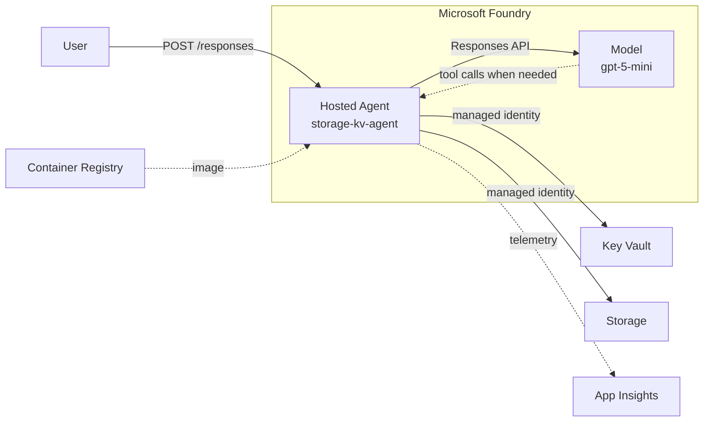

# Architecture - Hosted Agents

Back to the [lab README](../README.md).

## Problem

Teams want AI agents that call Azure data-plane resources (Storage, Key Vault, ...) without stuffing keys into containers, and without hand-rolling all of Foundry, networking, and identity. Hosted Agents give a managed runtime; this lab shows the **platform path** around them: IaC, OIDC deploy, instance identity + RBAC, and a small BYO Responses sample.

Not a full enterprise landing zone - a demoable vertical slice on West Europe.

## Portable platform concerns

| Concern | What it means in this lab |
|---------|---------------------------|
| Workload identity | Agent tools use the **agent instance** managed identity, not storage keys or KV secrets in the image |
| Network boundary | Foundry account with agent network injection into a lab VNet |
| Observability | Application Insights linked to the Foundry project; connection string injected into the agent |
| Deployable / teardown-friendly | Terraform + GitHub Actions; nightly destroy for cost control |
| CI/CD without long-lived secrets | OIDC to Azure for plan/apply and image deploy |

## Architecture (v1)

### What Terraform vs the deploy workflow own

Terraform cannot know the agent instance principal ID ahead of time:

| When | What |
|------|------|
| **Terraform apply** | RG, VNet, Foundry account + project, model deploy, ACR, Storage + container, Key Vault + demo secret, App Insights link, optional contributor grants for local developers (`additional_*_principal_ids`) |
| **Docker deploy workflow** | Build/push image, `azd` deploy, look up `instance_identity.principal_id`, assign **Storage Blob Data Contributor** + **Key Vault Secrets User** |

### Sample agent (`storage-kv-agent`)

BYO **Responses** protocol agent in **.NET 10** (`Azure.AI.AgentServer.Responses`):

- Forwards user input to a Foundry model; keeps conversation history
- Function tools: `get_demo_secret`, `persist_note`, `list_recent_notes` - run only when the model needs them
- `DefaultAzureCredential` → agent instance identity in Foundry; local CLI / env when testing on a laptop
- Health: `/readiness`; telemetry via App Insights when the connection string is present

Source: [`../src/storage-kv-agent/`](../src/storage-kv-agent/).

**Required environment (hosted):**

| Variable | Role |
|----------|------|
| `FOUNDRY_PROJECT_ENDPOINT` | Injected when hosted |
| `AZURE_AI_MODEL_DEPLOYMENT_NAME` | Default `gpt-5-mini` |
| `APPLICATIONINSIGHTS_CONNECTION_STRING` | Injected when project App Insights connection exists (Terraform creates it) |
| `AZURE_STORAGE_ACCOUNT_NAME` / `AZURE_STORAGE_CONTAINER_NAME` | Agent notes (default container `agent-notes`) |
| `AZURE_KEY_VAULT_URI` / `AZURE_KEY_VAULT_SECRET_NAME` | Demo secret (default `agent-demo-message`) |

### Data flow

1. User → agent `/responses`
2. Handler loads history, calls model with tools registered
3. Model may request Key Vault read or Storage write/list
4. Agent executes tools with MI; feeds results back
5. Final text returned; ordinary Q&A does not touch Storage or Key Vault

### Security boundaries

| Component | Identity | Access |
|-----------|----------|--------|
| Agent container | Agent instance MI | Storage Blob Data Contributor, Key Vault Secrets User, AcrPull |
| Terraform / Actions deployer | GitHub OIDC | Foundry User, Contributor on RG, Key Vault Administrator (as configured) |
| Local developer | Azure CLI | Via `additional_*_principal_ids` |

Storage and Key Vault use Azure AD auth only (no account keys).

### Shared module vs lab-local

Uses [`platform-core`](../../../shared-modules/platform-core/) for Foundry account, networking, Log Analytics, App Insights. Lab-local Terraform adds ACR, Key Vault, agent Storage, Foundry project, and model deployment. See [ADR 0003](../../../docs/adrs/0003-lab-terraform-module-strategy.md).
